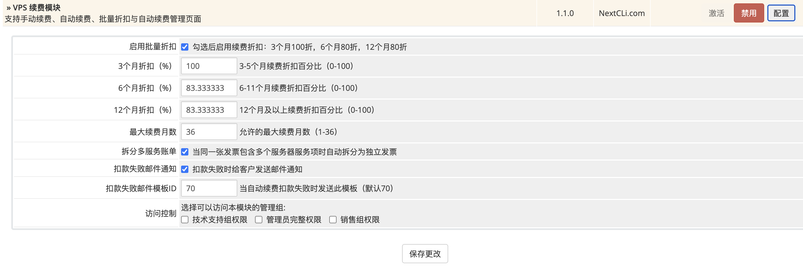

# WHMCS_Auto-Renewal_Plugin_Free

 WHMCS系统程序服务器VPS自动续费插件
 
 WHMCS Servers/VPS Auto Renewal Plugin (Free)
 


[中文说明](#中文说明) | [English](#english)

定制开发请联系 https://t.me/NextCLiBOT

## 中文说明

### 简介

这是一个用于 WHMCS 的 VPS / 服务器续费插件，支持手动续费和基于账户余额的自动续费。

插件会在客户端区域增加续费入口、自动续费管理能力、独立续费账单创建逻辑，以及到期后自动使用客户余额支付续费账单的能力。

本插件目前属于 https://my.nextcli.com/addons/auto-renewal/ 定制，并且线上商用！欢迎注册账号体验！

基于模版 RS Themes -> Lagom 2 -> Theme Version:2.0.1

其他版本可能会有兼容问题！

1、https://my.nextcli.com/clientarea.php?action=services 我的产品与服务 页面增加自动续费的开关 和 手动续费按钮

2、https://my.nextcli.com/addons/auto-renewal/ 新增自动续费管理，目前仅支持服务器/VPS

3、https://my.nextcli.com/clientarea.php?action=productdetails&id=123  产品详情页增加自动续费开关、手动续费按钮、自动续费管理入口

4、https://my.nextcli.com/clientarea.php?action=invoices 我的账单 新增手动支付按钮

**⚠️注意：**

本产品不基于产品的续费价格扣款，而是基于【产品 /Admin/configproducts.php + 产品本身的配置项 /Admin/configproductoptions.php】的原始价格进行计费，如：

**示例一：**

VPS 10usd/月，**半年支付50u/月**

VPS的可配置选项 IP 1个/1usd/月，半年价格=6usd

则总金额为=**10x6个月+1x6个月=66usd**


**示例二：**

独立服务器 20usd/月，一年支付200u/月

独立服务器的可配置选项 IP 1个/1usd/月，一年价格=12usd

则总金额=**20x12个月+1x12个月=252usd**


‼️ 这两个示例里，客户续费时都未享受半年、一年支付的优惠！

如果您的网站产品为 半年、1年支付 设定了优惠价格，您需要在后台插件 /Admin/configaddonmods.php 设计 6个月、12个月设计折扣，如图



### 功能特性

- 支持客户端手动续费
- 支持自动续费
- 自动续费使用 WHMCS 客户余额扣款
- 支持续费策略
  - 按当前账单周期续费
  - 按月续费
  - 按固定周期续费，例如 3 / 6 / 12 个月
- 支持续费阶梯折扣
- 折扣只作用于产品本体价格
  - 可配置项按原价计费，不参与折扣
- 创建独立续费账单
- 可选拆分多服务账单
- 自动续费失败邮件通知
- 客户端自动续费管理页面
- 优化账单和服务之间的关联显示
- 提供独立 Cron 脚本执行自动续费

### 适用场景

- 让客户在到期前主动续费 VPS / 服务器服务
- 让客户为指定服务开启自动续费
- 在服务到期时直接从客户余额完成续费
- 避免多个服务混在一张续费账单里
- 支持长期续费优惠，同时不对可配置项打折

### 工作流程

#### 手动续费

1. 客户打开产品详情页或自动续费管理页
2. 选择续费时长
3. 插件计算续费价格
4. 创建续费账单
5. 跳转到账单支付页面

#### 自动续费

1. 独立 Cron 检查已开启自动续费的服务
2. 如果服务到期，且当前没有未支付续费账单，则创建新账单
3. 如果客户余额充足，WHMCS 自动将余额应用到该账单
4. 支付成功后顺延服务到期时间
5. 如果余额不足或扣款失败，可发送失败通知邮件

### 价格规则

插件根据 WHMCS 内已有的服务价格计算续费金额。

- 产品价格作为续费基础价格
- 如果产品没有月付价，则自动从季付 / 半年 / 年付价格折算月价
- 可配置项金额会计入续费总价
- 折扣只作用于产品部分
- 可配置项不参与折扣
- 最终账单金额按 2 位小数保留

### 主要文件

- `renewal.php`
  - 处理手动续费请求
- `autocreditlist.php`
  - 客户端自动续费管理页
- `hooks.php`
  - 向客户端区域注入续费入口和相关数据
- `cron_autorenew.php`
  - 独立自动续费 Cron 脚本
- `lib_vpsrenew.php`
  - 核心业务逻辑
- `vpsrenew.php`
  - WHMCS 插件定义、配置、激活和后台输出

### 环境要求

- WHMCS 7.x 或 8.x
- PHP 7.2+
- 可正常执行 WHMCS Cron
- 若要使用自动续费，需要启用客户余额功能

### 安装方法

1. 将插件放到以下目录：

```text
modules/addons/vpsrenew
```

2. 进入 WHMCS 后台：

```text
Setup -> Addon Modules
```

3. 找到 `VPS 续费模块` 并点击 `Activate`

4. 打开 `Configure`，至少保存一次配置，确保模块配置被写入数据库

5. 如有必要，清理 WHMCS 模板缓存：

```bash
rm -rf templates_c/*
```

### 配置项说明

- `enable_discount`
  - 是否启用续费折扣
- `discount_3months`
  - 3-5 个月续费折扣百分比
- `discount_6months`
  - 6-11 个月续费折扣百分比
- `discount_12months`
  - 12 个月及以上续费折扣百分比
- `max_months`
  - 允许的最大续费月数
- `split_multi_service_invoice`
  - 是否拆分包含多个服务项的账单
- `notify_failed_payment`
  - 自动续费失败时是否发送邮件
- `failed_payment_email_template_id`
  - 自动续费失败邮件模板 ID

### Cron 配置

使用独立自动续费脚本：

```bash
php -q /whmcs/modules/addons/vpsrenew/cron_autorenew.php
```

Crontab 示例：

```bash
0 1 * * * /usr/bin/php -q /whmcs/modules/addons/vpsrenew/cron_autorenew.php
```

也可以显式传入 WHMCS 根目录：

```bash
WHMCS_ROOT=/path/to/whmcs php -q /whmcs/modules/addons/vpsrenew/cron_autorenew.php
```

### 自动续费失败邮件变量

如果启用了失败邮件通知，所选邮件模板可使用以下变量：

- `{$vpsrenew_service_id}`
- `{$vpsrenew_service_domain}`
- `{$vpsrenew_invoice_id}`
- `{$vpsrenew_fail_reason}`
- `{$vpsrenew_source}`
- `{$vpsrenew_next_due_date}`
- `{$vpsrenew_client_email}`

### 续费策略说明

插件内部支持三种续费模式：

- `cycle`
  - 按当前 WHMCS 账单周期续费
- `month`
  - 固定按 1 个月续费
- `fixed`
  - 固定按指定月份续费，例如 3 / 6 / 12 个月

### 重要行为说明

- 自动续费不会支付已经存在的未支付账单
- 如果某个服务已经有未支付续费账单，自动续费会跳过
- 只有客户余额足够时，才会自动扣款
- 续费账单会写入标记信息，便于后续追踪
- 服务到期时间会在支付成功后顺延
- 折扣显示和账单优惠行会自动生成

### 限制说明

- 主要面向 VPS / 服务器类服务
- 不用于域名续费或通用附加服务续费
- 依赖 WHMCS 中已有的有效价格配置
- 邮件模板中不要直接插入未转义 Smarty 花括号的 JavaScript


------

[English](#english) ｜ [中文说明](#中文说明) 

For custom development, please contact: https://t.me/NextCLiBOT

## English

### Overview

This is a WHMCS addon for manual renewal and balance-based auto renewal of VPS / server products.

The plugin adds renewal entry points in the client area, provides an auto-renewal management interface, creates dedicated renewal invoices, and can automatically pay eligible renewal invoices using client credit when services become due.

This plugin is currently customized for https://my.nextcli.com/addons/auto-renewal/ welcome to register an account and experience it!

Based on template RS Themes -> Lagom 2 -> Theme Version: 2.0.1

Other versions may have compatibility issues!

1. https://my.nextcli.com/clientarea.php?action=services My Products & Services page adds an Auto Renewal toggle and a Manual Renewal button.

2. https://my.nextcli.com/addons/auto-renewal/ adds Auto Renewal Management, currently supports Servers / VPS only.

3. https://my.nextcli.com/clientarea.php?action=productdetails&id=123 Product Details page adds an Auto Renewal toggle, Manual Renewal button, and Auto Renewal Management entry.

4. https://my.nextcli.com/clientarea.php?action=invoices My Invoices page adds a Manual Payment button.

**⚠️ Notice:**

This product does not charge based on the product’s renewal pricing. Billing is calculated based on the **original pricing configured in [Product /Admin/configproducts.php + Product Configurable Options /Admin/configproductoptions.php]**, for example:

**Example 1:**

VPS **10 USD/month**, **Semi-Annual payment 50 USD**

VPS configurable option: **1 IP / 1 USD per month**, semi-annual price = **6 USD**

Total amount = **10x6 months + 1x6 months = 66 USD**

**Example 2:**

Dedicated Server **20 USD/month**, **Annual payment 200 USD**

Dedicated server configurable option: **1 IP / 1 USD per month**, annual price = **12 USD**

Total amount = **20x12 months + 1x12 months = 252 USD**

‼️ In both examples above, the customer **does not receive the semi-annual or annual payment discount during renewal**.

If your website products have **discounted pricing for Semi-Annual or Annual billing cycles**, you need to configure the **6-month and 12-month discounts in the addon module backend** `/Admin/configaddonmods.php`, as shown below:


### Features

- Manual renewal from the client area
- Auto renewal support
- Auto renewal paid with WHMCS client credit
- Renewal strategy support
  - current billing cycle
  - monthly
  - fixed periods such as 3 / 6 / 12 months
- Tiered renewal discounts
- Discounts apply to the product price only
  - configurable options are charged at full price
- Separate renewal invoice creation
- Optional split of multi-service invoices
- Failed auto-renewal email notifications
- Client-facing auto-renewal management page
- Improved invoice / service linking in the client area
- Independent cron entry for auto-renewal

### Use Cases

- Let clients renew VPS / server services before the due date
- Let clients enable auto renewal for selected services
- Charge renewals directly from client credit balance
- Avoid mixing multiple services into a single renewal invoice
- Offer long-term renewal discounts without discounting configurable options

### How It Works

#### Manual Renewal

1. The client opens the service details page or the auto-renewal management page.
2. The client selects a renewal period.
3. The plugin calculates the renewal price.
4. A renewal invoice is created.
5. The client is redirected to the invoice page for payment.

#### Auto Renewal

1. The independent cron checks services with auto renewal enabled.
2. If a service is due and no unpaid renewal invoice exists, the plugin creates a new invoice.
3. If the client has enough credit, WHMCS applies credit automatically.
4. The service due date is extended after successful payment.
5. If balance is insufficient or payment fails, the plugin can send a failure email.

### Pricing Rules

The plugin calculates renewal amounts using pricing already stored in WHMCS.

- Product pricing is used as the renewal base
- If monthly product pricing is unavailable, the plugin derives a monthly price from quarterly / semi-annual / annual pricing
- Configurable options are included in the total renewal amount
- Discounts apply only to the product portion
- Configurable options are not discounted
- Final invoice totals are rounded to 2 decimal places

### Main Files

- `renewal.php`
  - Handles manual renewal requests
- `autocreditlist.php`
  - Client-facing auto-renewal management page
- `hooks.php`
  - Injects renewal UI and metadata into the client area
- `cron_autorenew.php`
  - Independent cron script for auto-renewal
- `lib_vpsrenew.php`
  - Core business logic
- `vpsrenew.php`
  - WHMCS addon definition, configuration, activation, and admin output

### Requirements

- WHMCS 7.x or 8.x
- PHP 7.2+
- A working WHMCS cron environment
- WHMCS client credit enabled if you want to use automatic balance payments

### Installation

1. Copy the plugin to:

```text
modules/addons/vpsrenew
```

2. In WHMCS Admin, go to:

```text
Setup -> Addon Modules
```

3. Find `VPS 续费模块` and click `Activate`

4. Open `Configure`, save once, and make sure the module configuration is stored successfully

5. If needed, clear the WHMCS template cache:

```bash
rm -rf templates_c/*
```

### Configuration

The addon exposes the following settings:

- `enable_discount`
  - Enable renewal discounts
- `discount_3months`
  - Discount percentage for 3-5 months
- `discount_6months`
  - Discount percentage for 6-11 months
- `discount_12months`
  - Discount percentage for 12+ months
- `max_months`
  - Maximum renewal period allowed
- `split_multi_service_invoice`
  - Split invoices containing multiple service items
- `notify_failed_payment`
  - Send email when auto-renewal payment fails
- `failed_payment_email_template_id`
  - Email template ID for failed auto-renewal notifications

### Cron Setup

Use the independent auto-renewal script:

```bash
php -q /whmcs/modules/addons/vpsrenew/cron_autorenew.php
```

Example crontab:

```bash
0 1 * * * /usr/bin/php -q /whmcs/modules/addons/vpsrenew/cron_autorenew.php
```

You can also pass the WHMCS root explicitly:

```bash
WHMCS_ROOT=/path/to/whmcs php -q /whmcs/modules/addons/vpsrenew/cron_autorenew.php
```

### Failed Payment Email Variables

If failed-payment notification is enabled, the selected email template can use:

- `{$vpsrenew_service_id}`
- `{$vpsrenew_service_domain}`
- `{$vpsrenew_invoice_id}`
- `{$vpsrenew_fail_reason}`
- `{$vpsrenew_source}`
- `{$vpsrenew_next_due_date}`
- `{$vpsrenew_client_email}`

### Renewal Strategy Notes

The plugin supports three renewal behaviors internally:

- `cycle`
  - Renew using the current WHMCS billing cycle
- `month`
  - Always renew for 1 month
- `fixed`
  - Renew for a specific number of months, such as 3 / 6 / 12

### Important Behavior

- Auto renewal does not pay already-existing unpaid invoices
- If an unpaid renewal invoice already exists for the service, auto renewal is skipped
- Credit is only applied when the client balance is sufficient
- Renewal invoices are tagged in invoice notes for tracking
- Due date extension happens only after successful payment
- Discount display and invoice discount lines are generated automatically

### Limitations

- Designed mainly for VPS / hosting-style services
- Not intended for domain renewals or generic addon renewals
- Requires valid WHMCS pricing records
- Email templates should not contain raw JavaScript with unescaped Smarty braces

End.
